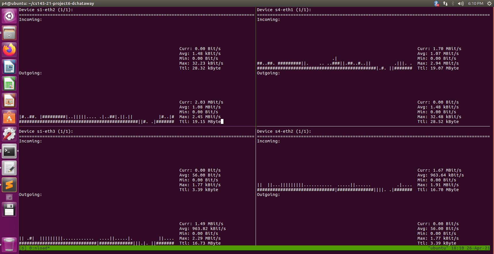

# CS 145 Project 6

## Author and collaborators
### Author name
David Chataway - davidchataway@g.harvard.edu

### Collaborators
I asked a few questions on Ed and also on a WhatApp chat to other students (without sharing or copying code). Also Mason was a massive help on this project. Thank you!

## Report
### Implementation
Our CONGA implementation in this project is rather simple and not the "true" CONGA implementation. CONGA implementations typically involve both packets that carry congestion metrics in the header as well as switches that track congestion to other first hop nodes on different paths in near real-time and then use greedy decisions to minimize bottlenecks by sending each packet on the least congested path.

In contrast, our CONGA implementation in this project randomly re-hashes flows that are congested based on certain conditions. The conditions defining "congestion" in my implementation are as follows:
1. The flow's queued packet depth (carried in the `telemetry` header) is greater than 45;
2. The incoming packet has a timestamp greater than a timeout threshold of 0.75 s per flow;
3. The flow meets the 33% movement ratio.  

As outlined in the `Readme.md`, the mechanism through which we notify ingress switches of congestion is through a feedback packet (created through cloning and recirculating externs with a unique ethernet type (i.e. 0x7778)) that triggers the `get_flow_id` action which generates and writes a random number corresponding to the flow to a register. That random number is then read and taken into account when hashing the 5-tuple according to the ECMP action.

Please ask if you have any more questions about my implementation or refer to my code which I have tried to heavily comment.

### Comparison between ECMP and CONGA
#### Overview: ECMP vs CONGA
- The advantage of ECMP is that flow traffic (with the same source and destination) is split randomly and uniformly across equal cost paths in order to locally attempt to avoid congestion and preserve packet order. However, ECMP is static and not aware of any congestion on the network. This can be a problem when we have flows of varied sizes like mice and elephant flows on the same path. It also does not deal well with asymmetry due to downstream bandwidth bottlenecks or link failures .
	
- The advantage of CONGA is that it is distributed and can dynamically detect and react to congestion in the flow in order to improve load balancing, especially with flows of varied size. The disadvantage is that packet reordering may occur (since typical CONGA load balances on a packet or flowlet level) and it does not scale well to "large multi-tier networks" because of its 2-way "leaf-to-leaf" sharing feedback mechanism between nodes.

#### Asymmetry Performance Example
The images below show screenshots of the nload sessions for the ECMP (first) and CONGA (second) implementations demonstrating their performance for the asymmetrical topology with a total bandwidth input of 5 mbps. Note that both screenshots were taken after a runtime of about 140 seconds.

A few observations can be made by comparing the nload session metrics:
1. The CONGA load balancing successfully limited congestion on the s3-s4 path (which had a total bandwidth of 2 mbps). This can be seen by the "Max" 2.01 mbps output bandwidth for s1-eth3 (which is linked to s4 through s3). In contrast, the ECMP controller had a "Max" 2.29 mbps output bandwidth, which would have resulted in congestion on the s3-s4 path.
2. As a result of limiting congestion along the s3-s4 path, CONGA yielded a higher average bandwidth incoming to s4-eth2 (1.12 mbps) than ECMP (963.64 kbps).
3. Overall, CONGA performed better than ECMP considering that the average total incoming bandwith to s4 was 2.19 mpbs relative to 2.03 mpbs with ECMP.
4. Feedback packets did seem to be successfully sent via CONGA based on the significantly higher outgoing traffic from s4-eth2 (through s3) to s1-eth3.
5. However, CONGA appeared to also result in a few instances of packet reordering (refer to the image below). 

In summary, CONGA resulted in a more efficient utilization of the asymmetrical network bandwidth. These results are expected based on the differences between ECMP and CONGA described in the Overview above. 

##### ECMP
 
##### CONGA
 
##### CONGA (Packet Out of Order)
Loadbalancer-outoforder
 

## Citations
The following are some informational sources used for background information on CONGA:
- https://hhk3.kau.se/dpp/wp-content/uploads/sites/19/2020/03/DVAD42-Webinar-2_final_compressed.pdf
- https://people.csail.mit.edu/alizadeh/papers/conga-sigcomm14.pdf

The following are some code sources that I used for help with specific code blocks:
- http://csie.nqu.edu.tw/smallko/sdn/p4utils_sendtocpu.htm
	- Used for the clone3 function implementation
- https://github.com/nsg-ethz/p4-learning/tree/master/exercises/10-Congestion_Aware_Load_Balancing
	- Used for the code blocks identified in the grading notes below

## Grading notes (if any)
Please note that I had to rely heavily on the last source listed above for help on this project (otherwise I would have had p4 syntax issues that I would not have been able to resolve). I only used that source when necessary (after many attempts myself) which resulted in me modifying the following specific code blocks:
- set_egress_type_table
- "cloned" metadata object for cloned packets
- register size 
- ingress processing for recirculated packets
- add_mirroring_ids in the controller code
- Condition in egress processing (standard_metadata.instance_type == PKT_INSTANCE_TYPE_NORMAL && hdr.ethernet.etherType != 0x7778)

Kindly let me know if you have any questions about this. Thank you in advance for your understanding. Let us all hope for expanded p4 documentation and forums in the future.

## Extra credit attempted (if any)
NA

